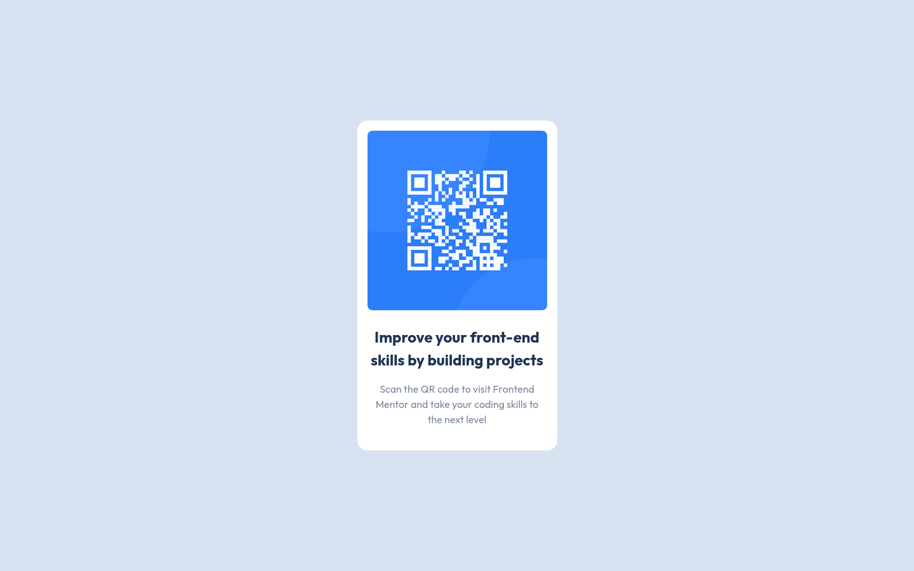

# Frontend Mentor - QR Code Component solution

This is a solution to the [QR Code Component challenge on Frontend Mentor](https://www.frontendmentor.io/challenges/qr-code-component-iux_sIO_H). Frontend Mentor challenges help you improve your coding skills by building realistic projects.

## Table of contents

- [Overview](#overview)
  - [Screenshot](#screenshot)
  - [Links](#links)
- [My process](#my-process)
  - [Built with](#built-with)
- [Author](#author)

## Overview

### Screenshot

### Links

- Solution URL: [Github](https://github.com/johnv2309/qr-code-component)
- Live Site URL: [Netlify](https://johnv2309-qr-code-component.netlify.app/)

## My process

### Built with

- Mobile-first workflow
- Semantic HTML5 markup
- CSS custom properties
- Flexbox

## Author

- Github - [John Victor](https://github.com/johnv2309)
- Frontend Mentor - [@johnv2309](https://www.frontendmentor.io/profile/yourusername)
